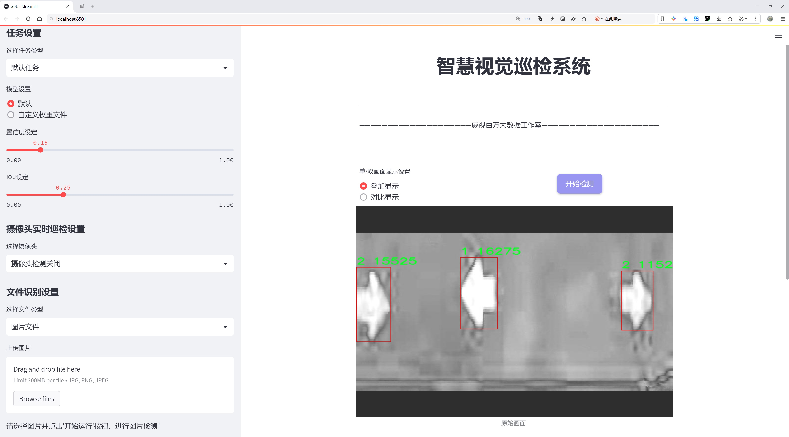
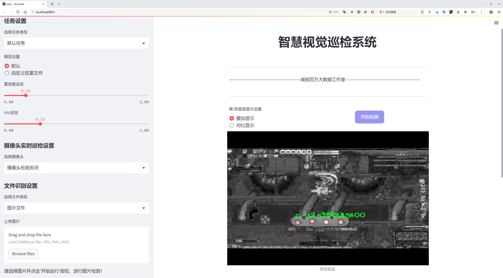
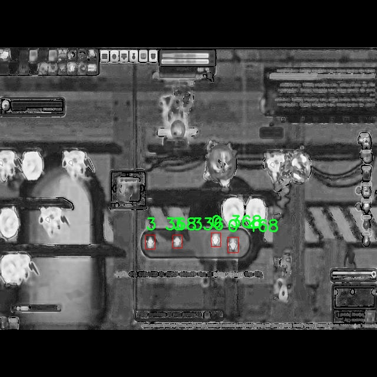
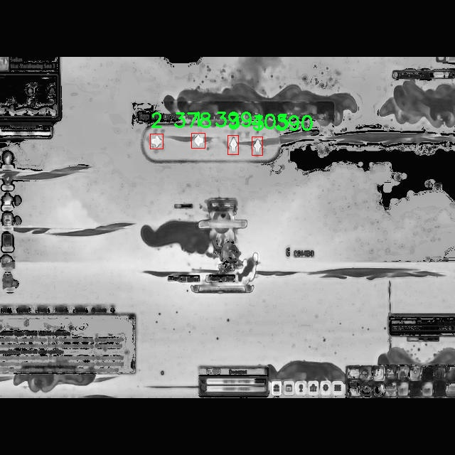
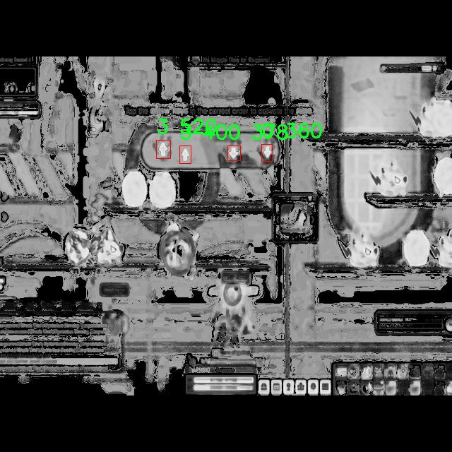

# 箭头检测检测系统源码分享
 # [一条龙教学YOLOV8标注好的数据集一键训练_70+全套改进创新点发刊_Web前端展示]

### 1.研究背景与意义

项目参考[AAAI Association for the Advancement of Artificial Intelligence](https://gitee.com/qunshansj/projects)

项目来源[AACV Association for the Advancement of Computer Vision](https://gitee.com/qunmasj/projects)

研究背景与意义

随着计算机视觉技术的迅猛发展，目标检测作为其重要分支之一，已广泛应用于自动驾驶、安防监控、智能制造等多个领域。近年来，YOLO（You Only Look Once）系列模型因其高效的实时检测能力和较好的检测精度而受到广泛关注。特别是YOLOv8的推出，进一步提升了目标检测的性能，使其在处理复杂场景和多目标检测时表现出色。然而，针对特定目标的检测，如箭头的检测，仍然面临诸多挑战，包括目标形状的多样性、背景复杂性以及不同光照条件下的识别难度。因此，基于改进YOLOv8的箭头检测系统的研究具有重要的理论价值和实际意义。

在本研究中，我们使用的数据集包含2700张图像，涵盖了四个类别的箭头。这些类别不仅包括不同方向的箭头，还可能涉及箭头的颜色、大小和样式等多样性特征。通过对这些图像的分析与处理，我们能够深入理解箭头在不同场景中的表现特征，从而为改进YOLOv8模型提供数据支持。数据集的丰富性和多样性为模型的训练和验证提供了良好的基础，使得我们能够在不同的环境条件下测试模型的鲁棒性和适应性。

改进YOLOv8的箭头检测系统不仅能够提高箭头识别的准确性，还能够在实时性上满足实际应用的需求。例如，在交通管理系统中，箭头的实时检测对于交通流量的监控和管理至关重要。通过精确识别道路上的箭头，系统能够及时调整交通信号，优化交通流，减少拥堵，提高道路安全性。此外，在智能制造领域，箭头的检测可以用于自动化生产线的物料识别与分类，提升生产效率和产品质量。

本研究的意义还在于推动目标检测技术在特定应用场景中的发展。通过对YOLOv8模型的改进，我们不仅可以提升箭头检测的性能，还能够为其他形状或符号的检测提供参考和借鉴。这将有助于拓展目标检测技术的应用范围，推动其在更广泛领域的落地实施。

综上所述，基于改进YOLOv8的箭头检测系统的研究，既是对现有目标检测技术的深入探索，也是对实际应用需求的积极响应。通过系统的研究与实践，我们期望能够为相关领域提供有效的解决方案，推动智能视觉技术的进一步发展与应用。

### 2.图片演示






##### 注意：由于此博客编辑较早，上面“2.图片演示”和“3.视频演示”展示的系统图片或者视频可能为老版本，新版本在老版本的基础上升级如下：（实际效果以升级的新版本为准）

  （1）适配了YOLOV8的“目标检测”模型和“实例分割”模型，通过加载相应的权重（.pt）文件即可自适应加载模型。

  （2）支持“图片识别”、“视频识别”、“摄像头实时识别”三种识别模式。

  （3）支持“图片识别”、“视频识别”、“摄像头实时识别”三种识别结果保存导出，解决手动导出（容易卡顿出现爆内存）存在的问题，识别完自动保存结果并导出到tempDir中。

  （4）支持Web前端系统中的标题、背景图等自定义修改，后面提供修改教程。

  另外本项目提供训练的数据集和训练教程,暂不提供权重文件（best.pt）,需要您按照教程进行训练后实现图片演示和Web前端界面演示的效果。

### 3.视频演示

[3.1 视频演示](https://www.bilibili.com/video/BV1FYtee4E3Z/)

### 4.数据集信息展示

##### 4.1 本项目数据集详细数据（类别数＆类别名）

nc: 4
names: ['0', '1', '2', '3']


##### 4.2 本项目数据集信息介绍

数据集信息展示

在本研究中，我们采用了名为“gray_maple”的数据集，以支持对YOLOv8箭头检测系统的改进。该数据集的设计旨在提供丰富的样本，以增强模型在箭头检测任务中的性能。数据集包含四个类别，分别标记为‘0’，‘1’，‘2’和‘3’，这些类别代表了不同类型的箭头图像，涵盖了多种可能的场景和应用。

“gray_maple”数据集的构建经过精心策划，确保了样本的多样性和代表性。每个类别的图像均经过严格筛选，确保其在实际应用中的有效性和准确性。类别‘0’可能代表基本的箭头形状，适用于简单的导航场景；类别‘1’则可能包含更复杂的箭头设计，适合于多方向指示的需求；类别‘2’和‘3’可能涵盖了特定环境下的箭头，如交通标志或特定行业应用中的指示箭头。这种多样化的类别设置使得数据集能够有效地训练模型，提升其在不同环境下的适应能力。

数据集的图像质量也是一个重要的考虑因素。所有图像均经过高分辨率拍摄，确保细节清晰可辨。这对于箭头检测任务至关重要，因为箭头的形状、方向和位置都可能影响最终的检测结果。此外，数据集中的图像还涵盖了不同的光照条件和背景环境，以模拟真实世界中的复杂情况。这种多样性不仅提高了模型的鲁棒性，也为后续的算法优化提供了丰富的训练素材。

在数据集的标注过程中，我们采用了高标准的标注流程，确保每个图像中的箭头都被准确标记。标注不仅包括箭头的边界框，还涵盖了箭头的类别信息。这种详细的标注方式使得模型在训练过程中能够学习到更为细致的特征，从而提高检测的准确性和效率。

为了进一步增强数据集的实用性，我们还考虑了数据增强技术的应用。通过对原始图像进行旋转、缩放、翻转等操作，我们能够生成更多的训练样本。这不仅增加了数据集的规模，也使得模型在面对不同变换时具备更强的适应能力。这样的数据增强策略对于深度学习模型的训练至关重要，能够有效防止过拟合现象的发生。

总之，“gray_maple”数据集为改进YOLOv8的箭头检测系统提供了坚实的基础。通过多样化的类别设置、高质量的图像、精确的标注以及有效的数据增强策略，该数据集在训练过程中将显著提升模型的性能。未来的研究将基于这一数据集，探索更为先进的算法和技术，以实现更高效的箭头检测解决方案。








### 5.全套项目环境部署视频教程（零基础手把手教学）

[5.1 环境部署教程链接（零基础手把手教学）](https://www.ixigua.com/7404473917358506534?logTag=c807d0cbc21c0ef59de5)


[5.2 安装Python虚拟环境创建和依赖库安装视频教程链接（零基础手把手教学）](https://www.ixigua.com/7404474678003106304?logTag=1f1041108cd1f708b01a)

### 6.手把手YOLOV8训练视频教程（零基础小白有手就能学会）

[6.1 手把手YOLOV8训练视频教程（零基础小白有手就能学会）](https://www.ixigua.com/7404477157818401292?logTag=d31a2dfd1983c9668658)

### 7.70+种全套YOLOV8创新点代码加载调参视频教程（一键加载写好的改进模型的配置文件）

[7.1 70+种全套YOLOV8创新点代码加载调参视频教程（一键加载写好的改进模型的配置文件）](https://www.ixigua.com/7404478314661806627?logTag=29066f8288e3f4eea3a4)

### 8.70+种全套YOLOV8创新点原理讲解（非科班也可以轻松写刊发刊，V10版本正在科研待更新）

由于篇幅限制，每个创新点的具体原理讲解就不一一展开，具体见下列网址中的创新点对应子项目的技术原理博客网址【Blog】：


[8.1 70+种全套YOLOV8创新点原理讲解链接](https://gitee.com/qunmasj/good)

### 9.系统功能展示（检测对象为举例，实际内容以本项目数据集为准）

图9.1.系统支持检测结果表格显示

  图9.2.系统支持置信度和IOU阈值手动调节

  图9.3.系统支持自定义加载权重文件best.pt(需要你通过步骤5中训练获得)

  图9.4.系统支持摄像头实时识别

  图9.5.系统支持图片识别

  图9.6.系统支持视频识别

  图9.7.系统支持识别结果文件自动保存

  图9.8.系统支持Excel导出检测结果数据


### 10.原始YOLOV8算法原理

原始YOLOv8算法原理

YOLOv8作为YOLO系列的最新迭代，继续沿用其前辈们的设计理念，同时在多个方面进行了创新和改进。其核心结构依然分为三个主要部分：Backbone、Neck和Head，每个部分都在前代算法的基础上进行了优化，以提高目标检测的性能和效率。

在Backbone部分，YOLOv8采用了一系列卷积和反卷积层，结合残差连接和瓶颈结构，以实现特征的高效提取。与YOLOv5相比，YOLOv8引入了C2f模块，取代了原有的C3模块。C2f模块的设计灵感来源于YOLOv7的ELAN模块，通过增加更多的残差连接，增强了网络的梯度流动，从而在保持轻量化的同时，提升了特征提取的丰富性和准确性。具体而言，C2f模块由多个CBS（卷积、归一化、激活）模块和Bottleneck结构组成，能够有效地捕捉到输入数据中的多层次特征信息。这样的设计使得YOLOv8在处理复杂场景时，能够更好地保持信息的完整性和准确性。

Neck部分则采用了PAN-FPN（Path Aggregation Network - Feature Pyramid Network）结构，旨在通过多尺度特征融合技术，进一步提升目标检测的性能。该部分通过将来自Backbone不同阶段的特征图进行融合，能够有效捕捉到不同尺度目标的信息。这种特征融合不仅增强了模型对小目标的检测能力，也提高了对复杂背景下目标的鲁棒性。YOLOv8在Neck结构中，去除了YOLOv5中上采样阶段的卷积层，直接将高层特征进行上采样后与中层特征进行拼接，从而实现了更高效的特征融合。

在Head部分，YOLOv8采用了最新的解耦合头结构，将目标分类和边框回归任务分开处理。这一设计不仅提高了模型的灵活性，也使得YOLOv8能够更好地适应不同的目标检测场景。此外，YOLOv8摒弃了传统的Anchor-Based方法，转而采用Anchor-Free的策略，这一变化使得模型在处理不同尺寸和形状的目标时，能够更加自如。Head部分的输出特征图分为三个不同的尺度，分别对应于80x80、40x40和20x20的特征图，这种多尺度输出使得YOLOv8在处理不同大小的目标时，能够保持较高的检测精度。

YOLOv8在损失函数的设计上也进行了创新，采用了BCELoss作为分类损失，DFLLoss和CIoULoss作为回归损失。这种损失函数的组合，不仅能够有效处理样本不平衡问题，还能提高模型在小目标检测中的表现。尤其是在处理复杂场景时，YOLOv8通过动态的样本分配策略，确保了模型在训练过程中的高效性和准确性。

值得一提的是，YOLOv8在数据增强方面也进行了改进，采用了包括马赛克增强、混合增强、空间扰动和颜色扰动等多种策略。这些数据增强手段不仅提高了模型的泛化能力，也增强了其在真实场景中的适应性。

综上所述，YOLOv8在原有YOLO系列的基础上，通过对Backbone、Neck和Head部分的创新设计，提升了目标检测的性能和效率。其引入的C2f模块、PAN-FPN结构、解耦合头以及Anchor-Free策略，标志着YOLO系列算法在目标检测领域的又一次重大进步。随着YOLOv8的推出，目标检测技术的应用前景将更加广阔，能够满足日益增长的实际需求。


### 11.项目核心源码讲解（再也不用担心看不懂代码逻辑）

#### 11.1 70+种YOLOv8算法改进源码大全和调试加载训练教程（非必要）\ultralytics\nn\backbone\fasternet.py

以下是对给定代码的核心部分进行提炼和详细注释的结果：

```python
import torch
import torch.nn as nn
from typing import List
from torch import Tensor

class PartialConv3(nn.Module):
    """
    实现部分卷积的类，用于在特定维度上进行卷积操作。
    """
    def __init__(self, dim, n_div, forward):
        super().__init__()
        self.dim_conv3 = dim // n_div  # 计算卷积通道数
        self.dim_untouched = dim - self.dim_conv3  # 计算未被卷积影响的通道数
        self.partial_conv3 = nn.Conv2d(self.dim_conv3, self.dim_conv3, 3, 1, 1, bias=False)  # 定义卷积层

        # 根据forward类型选择前向传播方式
        if forward == 'slicing':
            self.forward = self.forward_slicing
        elif forward == 'split_cat':
            self.forward = self.forward_split_cat
        else:
            raise NotImplementedError

    def forward_slicing(self, x: Tensor) -> Tensor:
        """
        仅用于推理的前向传播方法。
        """
        x = x.clone()  # 保持原始输入不变以便后续残差连接
        x[:, :self.dim_conv3, :, :] = self.partial_conv3(x[:, :self.dim_conv3, :, :])  # 进行卷积操作
        return x

    def forward_split_cat(self, x: Tensor) -> Tensor:
        """
        用于训练和推理的前向传播方法。
        """
        x1, x2 = torch.split(x, [self.dim_conv3, self.dim_untouched], dim=1)  # 将输入分为两部分
        x1 = self.partial_conv3(x1)  # 对第一部分进行卷积
        x = torch.cat((x1, x2), 1)  # 将两部分拼接
        return x


class MLPBlock(nn.Module):
    """
    定义一个多层感知机（MLP）块，包含卷积、归一化和激活函数。
    """
    def __init__(self, dim, n_div, mlp_ratio, drop_path, layer_scale_init_value, act_layer, norm_layer, pconv_fw_type):
        super().__init__()
        self.dim = dim
        self.mlp_ratio = mlp_ratio
        self.drop_path = nn.Identity() if drop_path <= 0 else DropPath(drop_path)  # 定义随机深度
        self.n_div = n_div

        mlp_hidden_dim = int(dim * mlp_ratio)  # 计算隐藏层维度

        # 定义MLP层
        mlp_layer: List[nn.Module] = [
            nn.Conv2d(dim, mlp_hidden_dim, 1, bias=False),
            norm_layer(mlp_hidden_dim),
            act_layer(),
            nn.Conv2d(mlp_hidden_dim, dim, 1, bias=False)
        ]
        self.mlp = nn.Sequential(*mlp_layer)  # 将MLP层组合成序列

        # 定义空间混合层
        self.spatial_mixing = PartialConv3(dim, n_div, pconv_fw_type)

        # 如果需要，初始化层缩放参数
        if layer_scale_init_value > 0:
            self.layer_scale = nn.Parameter(layer_scale_init_value * torch.ones((dim)), requires_grad=True)
            self.forward = self.forward_layer_scale  # 使用带层缩放的前向传播
        else:
            self.forward = self.forward  # 使用默认前向传播

    def forward(self, x: Tensor) -> Tensor:
        """
        前向传播函数。
        """
        shortcut = x  # 保存输入以进行残差连接
        x = self.spatial_mixing(x)  # 进行空间混合
        x = shortcut + self.drop_path(self.mlp(x))  # 残差连接
        return x

    def forward_layer_scale(self, x: Tensor) -> Tensor:
        """
        带层缩放的前向传播函数。
        """
        shortcut = x
        x = self.spatial_mixing(x)
        x = shortcut + self.drop_path(self.layer_scale.unsqueeze(-1).unsqueeze(-1) * self.mlp(x))  # 应用层缩放
        return x


class FasterNet(nn.Module):
    """
    FasterNet主网络结构。
    """
    def __init__(self, in_chans=3, num_classes=1000, embed_dim=96, depths=(1, 2, 8, 2), mlp_ratio=2., n_div=4,
                 patch_size=4, patch_stride=4, patch_size2=2, patch_stride2=2, patch_norm=True, drop_path_rate=0.1,
                 layer_scale_init_value=0, norm_layer='BN', act_layer='RELU', pconv_fw_type='split_cat'):
        super().__init__()

        # 选择归一化和激活函数
        norm_layer = nn.BatchNorm2d if norm_layer == 'BN' else NotImplementedError
        act_layer = nn.GELU if act_layer == 'GELU' else partial(nn.ReLU, inplace=True)

        self.num_stages = len(depths)  # 网络阶段数
        self.embed_dim = embed_dim  # 嵌入维度
        self.patch_norm = patch_norm  # 是否使用归一化
        self.mlp_ratio = mlp_ratio  # MLP比率
        self.depths = depths  # 每个阶段的深度

        # 将输入图像分割为不重叠的补丁
        self.patch_embed = PatchEmbed(patch_size=patch_size, patch_stride=patch_stride, in_chans=in_chans,
                                       embed_dim=embed_dim, norm_layer=norm_layer if self.patch_norm else None)

        # 随机深度衰减规则
        dpr = [x.item() for x in torch.linspace(0, drop_path_rate, sum(depths))]

        # 构建网络层
        stages_list = []
        for i_stage in range(self.num_stages):
            stage = BasicStage(dim=int(embed_dim * 2 ** i_stage), n_div=n_div, depth=depths[i_stage],
                               mlp_ratio=self.mlp_ratio, drop_path=dpr[sum(depths[:i_stage]):sum(depths[:i_stage + 1])],
                               layer_scale_init_value=layer_scale_init_value, norm_layer=norm_layer,
                               act_layer=act_layer, pconv_fw_type=pconv_fw_type)
            stages_list.append(stage)

            # 添加补丁合并层
            if i_stage < self.num_stages - 1:
                stages_list.append(PatchMerging(patch_size2=patch_size2, patch_stride2=patch_stride2,
                                                 dim=int(embed_dim * 2 ** i_stage), norm_layer=norm_layer))

        self.stages = nn.Sequential(*stages_list)  # 将所有阶段组合成序列

    def forward(self, x: Tensor) -> List[Tensor]:
        """
        前向传播函数，输出四个阶段的特征。
        """
        x = self.patch_embed(x)  # 嵌入补丁
        outs = []
        for idx, stage in enumerate(self.stages):
            x = stage(x)  # 通过每个阶段
            if idx in self.out_indices:  # 如果是输出阶段
                norm_layer = getattr(self, f'norm{idx}')  # 获取归一化层
                x_out = norm_layer(x)  # 应用归一化
                outs.append(x_out)  # 保存输出
        return outs  # 返回所有阶段的输出
```

### 代码核心部分解释：
1. **PartialConv3**: 实现了部分卷积的操作，支持两种前向传播方式（推理和训练）。
2. **MLPBlock**: 定义了一个多层感知机块，包含卷积、归一化和激活函数，并支持残差连接。
3. **FasterNet**: 主网络结构，负责构建整个网络，包括嵌入层、多个阶段和补丁合并层。前向传播函数输出多个阶段的特征。

### 其他辅助函数和模型创建函数：
这些函数主要用于加载模型权重和配置文件，通常在模型训练或推理时使用。可以根据需要进行保留或修改。

这个文件是一个实现了FasterNet模型的PyTorch代码，主要用于计算机视觉任务。代码中包含了模型的各个组成部分，包括卷积层、全连接层、特征提取等。首先，文件开头包含了版权信息和必要的库导入，包括PyTorch、YAML和一些用于构建神经网络的模块。

在代码中，`Partial_conv3`类定义了一个部分卷积层，它可以根据不同的前向传播方式（切片或拼接）处理输入张量。`MLPBlock`类则实现了一个多层感知机块，包含了卷积层、归一化层和激活函数。它还可以选择性地使用层级缩放来增强模型的表现。

`BasicStage`类是由多个`MLPBlock`组成的一个阶段，负责处理输入特征并传递到下一阶段。`PatchEmbed`和`PatchMerging`类分别用于将输入图像分割成补丁并进行合并，适用于处理不同层次的特征。

`FasterNet`类是整个模型的核心，它定义了网络的结构，包括输入通道、类别数、嵌入维度、各个阶段的深度等。模型的前向传播过程会将输入图像经过补丁嵌入、多个阶段的处理，并输出特征图。

文件中还定义了一些函数用于加载模型权重，如`update_weight`函数用于更新模型的权重字典，确保模型的权重与预训练权重匹配。`fasternet_t0`等函数则用于根据配置文件创建不同版本的FasterNet模型，并可选择加载预训练权重。

最后，文件的主程序部分展示了如何使用`fasternet_t0`函数加载模型，并对输入进行测试，输出每个阶段的特征图大小。这段代码为模型的使用提供了一个示例，便于用户理解如何进行模型的初始化和前向传播。整体来看，这个文件是FasterNet模型实现的一个完整示例，适合用于图像分类或其他计算机视觉任务。

#### 11.2 ui.py

以下是代码中最核心的部分，并附上详细的中文注释：

```python
import sys
import subprocess

def run_script(script_path):
    """
    使用当前 Python 环境运行指定的脚本。

    Args:
        script_path (str): 要运行的脚本路径

    Returns:
        None
    """
    # 获取当前 Python 解释器的路径
    python_path = sys.executable

    # 构建运行命令，使用 streamlit 运行指定的脚本
    command = f'"{python_path}" -m streamlit run "{script_path}"'

    # 执行命令
    result = subprocess.run(command, shell=True)
    # 检查命令执行的返回码，如果不为0则表示出错
    if result.returncode != 0:
        print("脚本运行出错。")

# 实例化并运行应用
if __name__ == "__main__":
    # 指定要运行的脚本路径
    script_path = "web.py"  # 这里可以替换为实际的脚本路径

    # 调用函数运行脚本
    run_script(script_path)
```

### 代码说明：
1. **导入模块**：
   - `sys`：用于访问与 Python 解释器紧密相关的变量和函数。
   - `subprocess`：用于执行外部命令和与其交互。

2. **`run_script` 函数**：
   - 该函数接收一个脚本路径作为参数，并使用当前 Python 环境运行该脚本。
   - 使用 `sys.executable` 获取当前 Python 解释器的路径，以确保使用正确的 Python 版本。
   - 构建一个命令字符串，使用 `streamlit` 模块运行指定的脚本。
   - 使用 `subprocess.run` 执行命令，并检查返回码以判断脚本是否成功运行。

3. **主程序块**：
   - 当脚本作为主程序运行时，指定要运行的脚本路径（在此示例中为 `web.py`）。
   - 调用 `run_script` 函数来执行指定的脚本。

这个程序文件名为 `ui.py`，其主要功能是通过当前的 Python 环境运行一个指定的脚本。程序首先导入了必要的模块，包括 `sys`、`os` 和 `subprocess`，以及一个自定义的路径处理模块 `abs_path`。

在 `run_script` 函数中，程序接受一个参数 `script_path`，这是要运行的脚本的路径。函数内部首先获取当前 Python 解释器的路径，接着构建一个命令字符串，这个命令会使用 `streamlit` 来运行指定的脚本。具体来说，命令的格式是 `"{python_path}" -m streamlit run "{script_path}"`，其中 `python_path` 是当前 Python 解释器的路径，`script_path` 是传入的脚本路径。

然后，程序使用 `subprocess.run` 方法来执行这个命令。`shell=True` 参数表示命令将在一个新的 shell 中执行。执行后，程序检查返回的结果，如果返回码不为 0，说明脚本运行过程中出现了错误，程序会打印出“脚本运行出错”的提示信息。

在文件的最后部分，程序通过 `if __name__ == "__main__":` 判断当前模块是否是主程序，如果是，则指定要运行的脚本路径为 `web.py`，并调用 `run_script` 函数来执行这个脚本。

总的来说，这个程序的核心功能是通过 Python 的 subprocess 模块来运行一个 Streamlit 应用脚本，并处理可能出现的错误。

#### 11.3 70+种YOLOv8算法改进源码大全和调试加载训练教程（非必要）\ultralytics\nn\extra_modules\afpn.py

以下是保留的核心代码部分，并添加了详细的中文注释：

```python
import torch
import torch.nn as nn
import torch.nn.functional as F
from ..modules.conv import Conv

# 定义基本的卷积块
class BasicBlock(nn.Module):
    def __init__(self, filter_in, filter_out):
        super(BasicBlock, self).__init__()
        # 定义两个卷积层
        self.conv1 = Conv(filter_in, filter_out, 3)  # 第一个卷积层，3x3卷积
        self.conv2 = Conv(filter_out, filter_out, 3, act=False)  # 第二个卷积层，3x3卷积，不使用激活函数

    def forward(self, x):
        residual = x  # 保存输入，用于残差连接
        out = self.conv1(x)  # 通过第一个卷积层
        out = self.conv2(out)  # 通过第二个卷积层
        out += residual  # 添加残差
        return self.conv1.act(out)  # 返回激活后的输出

# 定义上采样模块
class Upsample(nn.Module):
    def __init__(self, in_channels, out_channels, scale_factor=2):
        super(Upsample, self).__init__()
        # 定义上采样的卷积层和上采样操作
        self.upsample = nn.Sequential(
            Conv(in_channels, out_channels, 1),  # 1x1卷积层
            nn.Upsample(scale_factor=scale_factor, mode='bilinear')  # 双线性插值上采样
        )

    def forward(self, x):
        return self.upsample(x)  # 直接返回上采样后的结果

# 定义下采样模块
class Downsample_x2(nn.Module):
    def __init__(self, in_channels, out_channels):
        super(Downsample_x2, self).__init__()
        # 定义2倍下采样的卷积层
        self.downsample = Conv(in_channels, out_channels, 2, 2, 0)  # 2x2卷积，步幅为2

    def forward(self, x):
        return self.downsample(x)  # 返回下采样后的结果

# 定义自适应特征融合模块（ASFF）
class ASFF_2(nn.Module):
    def __init__(self, inter_dim=512):
        super(ASFF_2, self).__init__()
        self.inter_dim = inter_dim
        compress_c = 8  # 压缩通道数

        # 定义权重卷积层
        self.weight_level_1 = Conv(self.inter_dim, compress_c, 1)
        self.weight_level_2 = Conv(self.inter_dim, compress_c, 1)
        self.weight_levels = nn.Conv2d(compress_c * 2, 2, kernel_size=1, stride=1, padding=0)  # 权重层
        self.conv = Conv(self.inter_dim, self.inter_dim, 3)  # 最后的卷积层

    def forward(self, input1, input2):
        # 计算输入特征的权重
        level_1_weight_v = self.weight_level_1(input1)
        level_2_weight_v = self.weight_level_2(input2)

        # 合并权重并计算softmax
        levels_weight_v = torch.cat((level_1_weight_v, level_2_weight_v), 1)
        levels_weight = self.weight_levels(levels_weight_v)
        levels_weight = F.softmax(levels_weight, dim=1)  # 计算权重的softmax

        # 融合特征
        fused_out_reduced = input1 * levels_weight[:, 0:1, :, :] + input2 * levels_weight[:, 1:2, :, :]
        out = self.conv(fused_out_reduced)  # 通过卷积层
        return out  # 返回融合后的特征

# 定义特征金字塔网络（AFPN）
class AFPN_P345(nn.Module):
    def __init__(self, in_channels=[256, 512, 1024], out_channels=256, factor=4):
        super(AFPN_P345, self).__init__()
        # 定义输入通道到压缩通道的卷积层
        self.conv0 = Conv(in_channels[0], in_channels[0] // factor, 1)
        self.conv1 = Conv(in_channels[1], in_channels[1] // factor, 1)
        self.conv2 = Conv(in_channels[2], in_channels[2] // factor, 1)

        # 定义特征块
        self.body = BlockBody_P345([in_channels[0] // factor, in_channels[1] // factor, in_channels[2] // factor])

        # 定义输出通道的卷积层
        self.conv00 = Conv(in_channels[0] // factor, out_channels, 1)
        self.conv11 = Conv(in_channels[1] // factor, out_channels, 1)
        self.conv22 = Conv(in_channels[2] // factor, out_channels, 1)

    def forward(self, x):
        x0, x1, x2 = x  # 解包输入特征
        x0 = self.conv0(x0)  # 通过卷积层
        x1 = self.conv1(x1)
        x2 = self.conv2(x2)

        out0, out1, out2 = self.body([x0, x1, x2])  # 通过特征块处理
        out0 = self.conv00(out0)  # 输出卷积
        out1 = self.conv11(out1)
        out2 = self.conv22(out2)
        return [out0, out1, out2]  # 返回输出特征
```

### 代码核心部分解释：
1. **BasicBlock**: 定义了一个基本的卷积块，包含两个卷积层，并实现了残差连接。
2. **Upsample 和 Downsample**: 定义了上采样和下采样模块，使用卷积和插值方法来改变特征图的尺寸。
3. **ASFF_2**: 自适应特征融合模块，计算输入特征的权重并融合特征图。
4. **AFPN_P345**: 特征金字塔网络的核心部分，负责处理输入特征并输出融合后的特征图。

以上是代码的核心部分及其详细注释，帮助理解每个模块的功能和作用。

这个程序文件定义了一些用于YOLOv8算法改进的模块，主要包括各种卷积层、上采样和下采样操作，以及自适应特征融合（ASFF）模块。文件中包含多个类，每个类都实现了特定的功能。

首先，`BasicBlock`类定义了一个基本的残差块，包含两个卷积层和一个残差连接。该块的输入经过两个卷积操作后，与输入的残差相加，然后通过激活函数输出。

接下来，`Upsample`和`Downsample_x2`、`Downsample_x4`、`Downsample_x8`类分别实现了上采样和不同倍数的下采样操作。这些类通过卷积层和上采样/下采样操作来调整特征图的尺寸。

`ASFF_2`、`ASFF_3`和`ASFF_4`类实现了自适应特征融合模块，这些模块通过计算不同输入特征图的权重并进行加权融合，来提高特征的表达能力。每个ASFF模块的输入可以是不同数量的特征图，融合后通过卷积层输出。

`BlockBody_P345`和`BlockBody_P2345`类则定义了特定的网络结构，分别处理3个和4个尺度的特征图。它们通过堆叠多个基本块和ASFF模块，结合上采样和下采样操作，形成复杂的特征提取结构。

`AFPN_P345`和`AFPN_P2345`类是特征金字塔网络（FPN）的实现，负责将不同尺度的特征图进行处理并输出。它们的构造函数中包含卷积层和定义好的块体，最后通过初始化权重来优化模型的性能。

`BlockBody_P345_Custom`和`BlockBody_P2345_Custom`类允许用户自定义块的类型，提供了更大的灵活性，以便在不同的实验中使用不同的网络结构。

总的来说，这个文件提供了一系列用于构建YOLOv8模型的基础模块和网络结构，支持多尺度特征融合和自定义块类型，旨在提高目标检测的性能。

#### 11.4 code\ultralytics\utils\callbacks\clearml.py

以下是代码中最核心的部分，并附上详细的中文注释：

```python
# 导入必要的库
from ultralytics.utils import LOGGER, SETTINGS, TESTS_RUNNING

# 尝试导入 ClearML 库并进行一些基本的检查
try:
    assert not TESTS_RUNNING  # 确保当前不是在运行测试
    assert SETTINGS["clearml"] is True  # 确保 ClearML 集成已启用
    import clearml
    from clearml import Task  # 导入 ClearML 的 Task 类

    # 检查 ClearML 版本
    assert hasattr(clearml, "__version__")  # 确保 clearml 不是一个目录

except (ImportError, AssertionError):
    clearml = None  # 如果导入失败，设置 clearml 为 None


def on_pretrain_routine_start(trainer):
    """在预训练例程开始时运行；初始化并连接/记录任务到 ClearML。"""
    try:
        task = Task.current_task()  # 获取当前任务
        if task:
            # 确保自动的 PyTorch 和 Matplotlib 绑定被禁用
            PatchPyTorchModelIO.update_current_task(None)
            PatchedMatplotlib.update_current_task(None)
        else:
            # 初始化一个新的 ClearML 任务
            task = Task.init(
                project_name=trainer.args.project or "YOLOv8",  # 项目名称
                task_name=trainer.args.name,  # 任务名称
                tags=["YOLOv8"],  # 标签
                output_uri=True,
                reuse_last_task_id=False,
                auto_connect_frameworks={"pytorch": False, "matplotlib": False},  # 禁用自动连接
            )
            LOGGER.warning(
                "ClearML Initialized a new task. If you want to run remotely, "
                "please add clearml-init and connect your arguments before initializing YOLO."
            )
        task.connect(vars(trainer.args), name="General")  # 连接训练参数
    except Exception as e:
        LOGGER.warning(f"WARNING ⚠️ ClearML installed but not initialized correctly, not logging this run. {e}")


def on_train_epoch_end(trainer):
    """在 YOLO 训练的每个 epoch 结束时记录调试样本并报告当前训练进度。"""
    task = Task.current_task()  # 获取当前任务
    if task:
        # 记录调试样本
        if trainer.epoch == 1:  # 仅在第一个 epoch 记录
            _log_debug_samples(sorted(trainer.save_dir.glob("train_batch*.jpg")), "Mosaic")
        # 报告当前训练进度
        for k, v in trainer.label_loss_items(trainer.tloss, prefix="train").items():
            task.get_logger().report_scalar("train", k, v, iteration=trainer.epoch)  # 记录训练损失
        for k, v in trainer.lr.items():
            task.get_logger().report_scalar("lr", k, v, iteration=trainer.epoch)  # 记录学习率


def on_train_end(trainer):
    """在训练完成时记录最终模型及其名称。"""
    task = Task.current_task()  # 获取当前任务
    if task:
        # 记录最终结果，包括混淆矩阵和 PR 曲线
        files = [
            "results.png",
            "confusion_matrix.png",
            "confusion_matrix_normalized.png",
            *(f"{x}_curve.png" for x in ("F1", "PR", "P", "R")),
        ]
        files = [(trainer.save_dir / f) for f in files if (trainer.save_dir / f).exists()]  # 过滤存在的文件
        for f in files:
            _log_plot(title=f.stem, plot_path=f)  # 记录图像
        # 报告最终指标
        for k, v in trainer.validator.metrics.results_dict.items():
            task.get_logger().report_single_value(k, v)  # 记录指标
        # 记录最终模型
        task.update_output_model(model_path=str(trainer.best), model_name=trainer.args.name, auto_delete_file=False)


# 定义回调函数
callbacks = (
    {
        "on_pretrain_routine_start": on_pretrain_routine_start,
        "on_train_epoch_end": on_train_epoch_end,
        "on_train_end": on_train_end,
    }
    if clearml
    else {}
)
```

### 代码说明：
1. **ClearML 集成**：代码首先尝试导入 ClearML 库，并确保其集成设置正确。如果导入失败，则将 `clearml` 设置为 `None`。
2. **任务初始化**：在预训练开始时，代码会初始化一个 ClearML 任务，并连接训练参数。若任务已存在，则更新当前任务的状态。
3. **训练过程记录**：在每个训练 epoch 结束时，代码会记录调试样本、训练损失和学习率等信息。
4. **训练结束处理**：在训练结束时，代码会记录最终的模型和相关的性能指标，包括混淆矩阵和 PR 曲线等。

通过这些核心功能，代码实现了对 YOLO 训练过程的监控和记录，便于后续分析和调试。

这个程序文件是一个用于集成 ClearML 的回调函数模块，主要用于在训练 YOLO 模型时记录和报告各种训练和验证信息。文件中首先导入了一些必要的库和模块，并进行了基本的错误处理，以确保 ClearML 库可用且集成已启用。

在文件中定义了几个主要的函数。`_log_debug_samples` 函数用于将调试样本（通常是图像）记录到当前的 ClearML 任务中。它接收一个文件路径列表和一个标题作为参数，遍历文件列表并将存在的文件记录为图像，提取批次信息以便于跟踪。

`_log_plot` 函数用于将图像作为绘图记录到 ClearML 的绘图部分。它接收图像的标题和路径，使用 Matplotlib 读取并显示图像，然后将其报告到 ClearML。

`on_pretrain_routine_start` 函数在预训练例程开始时运行，初始化并连接当前任务到 ClearML。如果任务已经存在，它会禁用自动的 PyTorch 和 Matplotlib 绑定，以便手动记录相关信息；如果没有，它会创建一个新的任务并连接训练参数。

`on_train_epoch_end` 函数在每个训练周期结束时被调用，记录调试样本和当前训练进度。在第一个周期结束时，它会记录训练样本的图像，并报告当前的损失值和学习率。

`on_fit_epoch_end` 函数在每个适配周期结束时被调用，记录模型信息和验证指标，确保在第一个周期时记录模型的基本信息。

`on_val_end` 函数在验证结束时被调用，记录验证结果，包括标签和预测。

`on_train_end` 函数在训练完成时被调用，记录最终模型及其名称，报告最终的性能指标，并记录最终的混淆矩阵和其他相关图表。

最后，文件定义了一个回调字典，包含了上述函数，只有在 ClearML 可用时才会被填充。这个模块的主要目的是通过 ClearML 平台对 YOLO 模型的训练过程进行详细的记录和监控，以便于后续的分析和优化。

#### 11.5 train.py

以下是经过简化和注释的核心代码部分：

```python
import random
import numpy as np
import torch.nn as nn
from ultralytics.data import build_dataloader, build_yolo_dataset
from ultralytics.engine.trainer import BaseTrainer
from ultralytics.models import yolo
from ultralytics.nn.tasks import DetectionModel
from ultralytics.utils import LOGGER, RANK
from ultralytics.utils.torch_utils import de_parallel, torch_distributed_zero_first

class DetectionTrainer(BaseTrainer):
    """
    基于检测模型的训练类，继承自BaseTrainer类。
    """

    def build_dataset(self, img_path, mode="train", batch=None):
        """
        构建YOLO数据集。

        参数:
            img_path (str): 包含图像的文件夹路径。
            mode (str): 模式，可以是'train'或'val'，用户可以为每种模式自定义不同的增强。
            batch (int, optional): 批次大小，适用于'rect'模式。默认为None。
        """
        gs = max(int(de_parallel(self.model).stride.max() if self.model else 0), 32)  # 获取模型的最大步幅
        return build_yolo_dataset(self.args, img_path, batch, self.data, mode=mode, rect=mode == "val", stride=gs)

    def get_dataloader(self, dataset_path, batch_size=16, rank=0, mode="train"):
        """构造并返回数据加载器。"""
        assert mode in ["train", "val"]  # 确保模式有效
        with torch_distributed_zero_first(rank):  # 在分布式环境中初始化数据集
            dataset = self.build_dataset(dataset_path, mode, batch_size)  # 构建数据集
        shuffle = mode == "train"  # 训练模式下打乱数据
        workers = self.args.workers if mode == "train" else self.args.workers * 2  # 设置工作线程数
        return build_dataloader(dataset, batch_size, workers, shuffle, rank)  # 返回数据加载器

    def preprocess_batch(self, batch):
        """对图像批次进行预处理，包括缩放和转换为浮点数。"""
        batch["img"] = batch["img"].to(self.device, non_blocking=True).float() / 255  # 转换为浮点数并归一化
        if self.args.multi_scale:  # 如果启用多尺度
            imgs = batch["img"]
            sz = (
                random.randrange(self.args.imgsz * 0.5, self.args.imgsz * 1.5 + self.stride)
                // self.stride
                * self.stride
            )  # 随机选择新的尺寸
            sf = sz / max(imgs.shape[2:])  # 计算缩放因子
            if sf != 1:
                ns = [
                    math.ceil(x * sf / self.stride) * self.stride for x in imgs.shape[2:]
                ]  # 计算新的形状
                imgs = nn.functional.interpolate(imgs, size=ns, mode="bilinear", align_corners=False)  # 进行插值
            batch["img"] = imgs  # 更新批次图像
        return batch

    def get_model(self, cfg=None, weights=None, verbose=True):
        """返回YOLO检测模型。"""
        model = DetectionModel(cfg, nc=self.data["nc"], verbose=verbose and RANK == -1)  # 创建检测模型
        if weights:
            model.load(weights)  # 加载权重
        return model

    def plot_training_samples(self, batch, ni):
        """绘制带有注释的训练样本。"""
        plot_images(
            images=batch["img"],
            batch_idx=batch["batch_idx"],
            cls=batch["cls"].squeeze(-1),
            bboxes=batch["bboxes"],
            paths=batch["im_file"],
            fname=self.save_dir / f"train_batch{ni}.jpg",
            on_plot=self.on_plot,
        )

    def plot_metrics(self):
        """从CSV文件中绘制指标。"""
        plot_results(file=self.csv, on_plot=self.on_plot)  # 保存结果图
```

### 代码说明：
1. **DetectionTrainer类**：这是一个用于训练YOLO检测模型的类，继承自基础训练类`BaseTrainer`。
2. **build_dataset方法**：根据输入的图像路径和模式（训练或验证）构建YOLO数据集。
3. **get_dataloader方法**：构造数据加载器，支持分布式训练，确保在训练模式下打乱数据。
4. **preprocess_batch方法**：对输入的图像批次进行预处理，包括归一化和可能的多尺度调整。
5. **get_model方法**：返回一个YOLO检测模型，并可选择加载预训练权重。
6. **plot_training_samples方法**：绘制训练样本及其注释，便于可视化训练过程。
7. **plot_metrics方法**：从CSV文件中提取并绘制训练指标，帮助监控训练效果。

这个程序文件 `train.py` 是一个用于训练 YOLO（You Only Look Once）目标检测模型的 Python 脚本，继承自 `BaseTrainer` 类。文件中定义了一个 `DetectionTrainer` 类，专门用于处理目标检测任务。

在这个类中，首先通过 `build_dataset` 方法构建 YOLO 数据集。该方法接收图像路径、模式（训练或验证）和批量大小作为参数。它会根据模型的步幅计算一个合适的值，并调用 `build_yolo_dataset` 函数来生成数据集。

接下来，`get_dataloader` 方法用于构建数据加载器。它会检查模式是否为训练或验证，并在分布式训练的情况下确保数据集只初始化一次。该方法还会根据模式设置是否打乱数据，并返回构建好的数据加载器。

`preprocess_batch` 方法负责对图像批次进行预处理，包括将图像缩放到适当的大小并转换为浮点数。该方法支持多尺度训练，随机选择图像的大小，并使用双线性插值调整图像的尺寸。

`set_model_attributes` 方法用于设置模型的属性，包括类别数量和类别名称等。这些属性将影响模型的训练和推理过程。

`get_model` 方法用于返回一个 YOLO 检测模型实例。如果提供了权重文件，它会加载这些权重。

`get_validator` 方法返回一个用于模型验证的 `DetectionValidator` 实例，能够计算并记录损失值。

`label_loss_items` 方法返回一个包含训练损失项的字典，便于在训练过程中监控模型的性能。

`progress_string` 方法生成一个格式化的字符串，用于显示训练进度，包括当前的轮次、GPU 内存使用情况、损失值、实例数量和图像大小等信息。

`plot_training_samples` 方法用于绘制训练样本及其标注，帮助可视化训练过程中的数据。

最后，`plot_metrics` 和 `plot_training_labels` 方法分别用于绘制训练过程中的指标和标签，便于分析模型的训练效果。

总体来说，这个文件提供了一个完整的框架，用于训练 YOLO 模型，处理数据集，进行预处理，监控训练进度，并可视化结果。

#### 11.6 code\ultralytics\data\explorer\gui\dash.py

以下是代码中最核心的部分，并附上详细的中文注释：

```python
import time
from threading import Thread
import streamlit as st
from ultralytics import Explorer

def _get_explorer():
    """初始化并返回Explorer类的实例。"""
    # 从session_state中获取数据集和模型
    exp = Explorer(data=st.session_state.get("dataset"), model=st.session_state.get("model"))
    
    # 创建一个线程来生成嵌入表
    thread = Thread(
        target=exp.create_embeddings_table, 
        kwargs={"force": st.session_state.get("force_recreate_embeddings")}
    )
    thread.start()  # 启动线程
    
    # 显示进度条
    progress_bar = st.progress(0, text="Creating embeddings table...")
    while exp.progress < 1:  # 当进度小于1时，持续更新进度条
        time.sleep(0.1)  # 每0.1秒检查一次进度
        progress_bar.progress(exp.progress, text=f"Progress: {exp.progress * 100}%")
    
    thread.join()  # 等待线程完成
    st.session_state["explorer"] = exp  # 将生成的Explorer实例存入session_state
    progress_bar.empty()  # 清空进度条

def init_explorer_form():
    """初始化Explorer实例并创建嵌入表，带有进度跟踪。"""
    # 获取数据集的路径
    datasets = ROOT / "cfg" / "datasets"
    ds = [d.name for d in datasets.glob("*.yaml")]  # 获取所有yaml格式的数据集文件名
    
    # 定义可用的模型列表
    models = [
        "yolov8n.pt", "yolov8s.pt", "yolov8m.pt", 
        "yolov8l.pt", "yolov8x.pt", "yolov8n-seg.pt", 
        "yolov8s-seg.pt", "yolov8m-seg.pt", "yolov8l-seg.pt", 
        "yolov8x-seg.pt", "yolov8n-pose.pt", "yolov8s-pose.pt", 
        "yolov8m-pose.pt", "yolov8l-pose.pt", "yolov8x-pose.pt",
    ]
    
    # 创建一个表单用于选择数据集和模型
    with st.form(key="explorer_init_form"):
        col1, col2 = st.columns(2)  # 创建两列布局
        with col1:
            st.selectbox("Select dataset", ds, key="dataset", index=ds.index("coco128.yaml"))  # 选择数据集
        with col2:
            st.selectbox("Select model", models, key="model")  # 选择模型
        st.checkbox("Force recreate embeddings", key="force_recreate_embeddings")  # 选择是否强制重新创建嵌入
        
        # 提交按钮，点击后调用_get_explorer函数
        st.form_submit_button("Explore", on_click=_get_explorer)

def layout():
    """设置页面布局，提供文档链接和API文档。"""
    st.set_page_config(layout="wide", initial_sidebar_state="collapsed")  # 设置页面配置
    st.markdown("<h1 style='text-align: center;'>Ultralytics Explorer Demo</h1>", unsafe_allow_html=True)

    # 如果session_state中的explorer为空，则初始化表单
    if st.session_state.get("explorer") is None:
        init_explorer_form()
        return

    st.button(":arrow_backward: Select Dataset", on_click=reset_explorer)  # 返回选择数据集的按钮
    exp = st.session_state.get("explorer")  # 获取当前的Explorer实例

    # 其他布局和功能代码省略...

if __name__ == "__main__":
    layout()  # 运行布局函数
```

### 代码核心部分说明：
1. **_get_explorer函数**：该函数负责初始化`Explorer`类的实例，并在后台线程中创建嵌入表，同时显示进度条，直到嵌入表创建完成。
2. **init_explorer_form函数**：该函数用于创建一个表单，允许用户选择数据集和模型，并提供一个按钮来提交选择，触发嵌入表的创建。
3. **layout函数**：该函数设置页面的整体布局，检查是否已有`Explorer`实例，如果没有则调用初始化表单。

这个程序文件是一个使用Streamlit框架构建的Web应用，旨在提供一个用户界面来探索和查询Ultralytics YOLO模型的数据集。代码的主要功能包括初始化数据集和模型、创建嵌入表、执行SQL查询、AI查询以及查找相似图像等。

程序首先导入必要的库，包括时间处理、线程处理、数据处理的Pandas库，以及Ultralytics的Explorer类和一些工具函数。它还检查所需的库是否已安装，确保环境的正确性。

`_get_explorer`函数用于初始化Explorer实例，并在后台线程中创建嵌入表。在此过程中，程序会显示一个进度条，实时更新创建进度，直到嵌入表创建完成。

`init_explorer_form`函数设置了一个表单，允许用户选择数据集和模型，并选择是否强制重新创建嵌入。用户提交表单后，会调用`_get_explorer`函数。

`query_form`和`ai_query_form`函数分别设置了用于输入SQL查询和AI查询的表单。用户可以在这些表单中输入查询条件并提交，程序会相应地执行查询。

`find_similar_imgs`函数用于查找与用户选择的图像相似的图像。它会调用Explorer实例的`get_similar`方法，并将结果存储在会话状态中。

`similarity_form`函数则是为相似图像查询设置的表单，用户可以在其中输入限制条件，并提交查询。

`run_sql_query`和`run_ai_query`函数分别执行SQL查询和AI查询，并将结果存储在会话状态中，以便后续使用。

`reset_explorer`函数用于重置Explorer的状态，清除会话中的相关变量。

`utralytics_explorer_docs_callback`函数提供了一个文档链接，用户可以通过这个链接访问Ultralytics Explorer API的文档。

`layout`函数是程序的主布局函数，设置了页面的配置和结构。如果Explorer实例尚未初始化，程序会调用`init_explorer_form`函数；如果已初始化，则显示图像、查询表单和相似性搜索表单。

最后，程序通过`if __name__ == "__main__":`语句调用`layout`函数，启动整个应用。

整体来看，这个程序为用户提供了一个友好的界面，以便于他们探索和查询数据集中的图像，利用YOLO模型进行更深入的分析。

### 12.系统整体结构（节选）

### 整体功能和构架概括

该项目是一个用于目标检测的YOLOv8模型实现，包含多个模块和功能，旨在提供一个完整的训练、验证和推理框架。整体架构包括数据处理、模型定义、训练过程、回调机制以及用户界面等部分。每个模块都有其特定的功能，协同工作以实现高效的目标检测。

- **数据处理**：包括数据加载、预处理和增强，确保输入数据的质量。
- **模型定义**：实现了YOLOv8及其变种的模型结构，支持多种网络架构和特征提取模块。
- **训练与验证**：提供训练过程的管理，包括损失计算、模型评估和超参数调整。
- **回调机制**：集成了ClearML等工具，用于监控训练过程和记录性能指标。
- **用户界面**：使用Streamlit构建的Web应用，允许用户交互式地探索数据集和模型结果。

### 文件功能整理表

| 文件路径                                                                 | 功能描述                                                                                     |
|--------------------------------------------------------------------------|----------------------------------------------------------------------------------------------|
| `ultralytics/nn/backbone/fasternet.py`                                  | 实现FasterNet模型，包括卷积层、特征提取和自适应特征融合模块。                             |
| `ui.py`                                                                  | 提供一个命令行界面，用于运行指定的Streamlit脚本。                                           |
| `ultralytics/nn/extra_modules/afpn.py`                                  | 定义特征金字塔网络（FPN）和自适应特征融合模块，支持多尺度特征处理。                       |
| `ultralytics/utils/callbacks/clearml.py`                                | 集成ClearML，用于记录训练过程中的指标和可视化结果。                                        |
| `train.py`                                                              | 定义训练过程，构建数据集和数据加载器，处理模型训练和验证。                                 |
| `ultralytics/data/explorer/gui/dash.py`                                 | 使用Streamlit构建的Web应用，提供数据集探索和查询功能。                                     |
| `ultralytics/models/yolo/detect/__init__.py`                            | 初始化YOLO检测模块，可能包含模型加载和推理功能。                                           |
| `ultralytics/models/sam/model.py`                                       | 实现SAM（Segment Anything Model）模型，支持图像分割任务。                                   |
| `__init__.py`                                                           | 包含包的初始化代码，可能用于设置模块的导入和配置。                                          |
| `ultralytics/utils/triton.py`                                          | 可能用于与NVIDIA Triton Inference Server集成，支持模型推理服务。                           |
| `ultralytics/utils/callbacks/__init__.py`                               | 初始化回调模块，可能包含各种训练回调的导入和配置。                                         |
| `ultralytics/data/loaders.py`                                           | 定义数据加载器，负责加载和预处理训练和验证数据集。                                         |
| `ultralytics/models/yolo/pose/val.py`                                   | 实现YOLO模型的姿态估计验证功能，计算验证指标和性能评估。                                   |

这个表格概述了每个文件的主要功能，帮助理解整个项目的结构和各个模块之间的关系。

注意：由于此博客编辑较早，上面“11.项目核心源码讲解（再也不用担心看不懂代码逻辑）”中部分代码可能会优化升级，仅供参考学习，完整“训练源码”、“Web前端界面”和“70+种创新点源码”以“13.完整训练+Web前端界面+70+种创新点源码、数据集获取”的内容为准。

### 13.完整训练+Web前端界面+70+种创新点源码、数据集获取


# [下载链接：https://mbd.pub/o/bread/ZpuWlpZs](https://mbd.pub/o/bread/ZpuWlpZs)